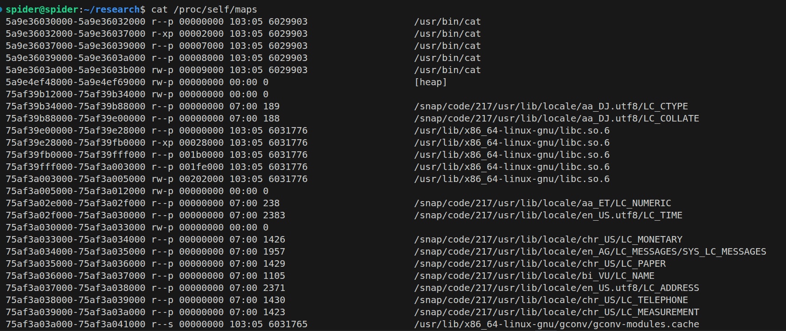
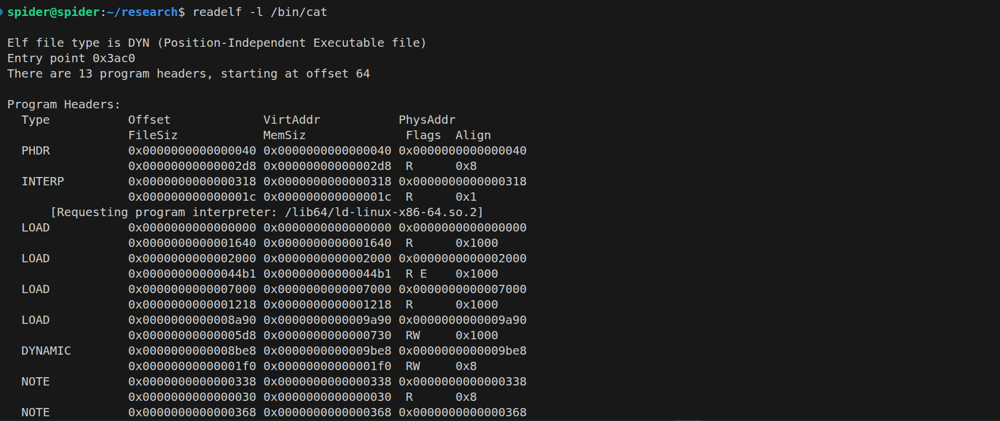
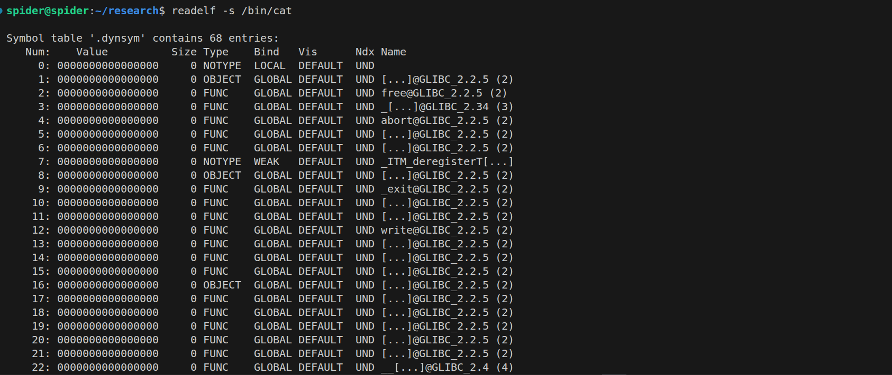
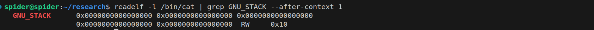

# Back Story

Durin the last days I was in an independent engagement with a ministry of one of the Gulf countries that worth spending time writing about it for the public, especialy because it touchs a point that bothers me in corporate cyber security, it's the part when the cyber security turns into a storm of incidents a day each one of them is just an IP attempting to scan ports or a directory brute force on a public facing server that ha a resolution of blocking the source IP, or when a an attacker gets into a system and start downloading tools like mimikatz or sharphound without even bothering to rename it and the security team call it a sophosticated adversary attack, also that moment when security monitoring service thinks that we don't need hunters or forensic investigators anymore.

I can't say that this is bad, them being able to block possible recon attempt or responding to such attackers trying to discover or move through thier environment, that is actually their main job in the security monitoring service, but the issue is the terms that they are now using to over credit their activities in the client's eyes by using terms like APT, nation state, or sophosticated attacks for script kiddies, and reporting big numbers of incidents even if they shouldn't be called so, because this will make thier monthly report loaded.

As a result of this practice, analysts starts to actually belive that this is the end of the line and gets pushed to their confort zone, and real cyber security mind set that should be developed with the time to help them grow in technicality with thie carrer to DFIR or R&D roles turns into a reporter mind set how wants to just pless the coustomers using fancy terms that he ends up beliving it himself.

As I see this a big issue, I wanted to share this as a reminder for what nation state sophosticted attack could be.

# Engagement background

This was an indepentent engagement over part of the sensetive network on a highly guarded environment, there was a number of other indepentent investigators & hunters with the purpose of discovering any hidden espinoge operations within the network.

And despite the environment being one of the most heavily protected and restictive networks I have ever seen, there were multiple findings that suggests multiple APTs not just single one, and none of them raised any alerts in this highly guarded inferastructure, I had couple of intersting findings I will go through one of the sophosticated techniques I found being used through this article.

    all the content and pictures I will produce has been done as a replication to what was there and not related or taken from real systems on operations, it was completly a replication in my testing environment

# Attacker View

I will start be demonistrating what the attacker is getting out of executing this chain of techniques then we will move to explaining the prerequisites to understand this attack (Which are a lot of semi complecated stuff depending on the reader's background) then understanding the internals of the attack itself after being comfortable with the prerequisites.


TBD

# Prerequisites

To understand how this attack works, we need to understand the components that this attack is relying on or in other words abusing to achive it.

## Memory Layout

Understanding how a running program organizes its memory is foundational to understand **what lives where** and **why the system trusts certain regions**.

1. **WHERE** things are stored in memory
2. **HOW** they are organized
3. **WHAT** protections exist
4. **WHY** certain memory regions have specific permissions

Think of memory as a building with different floors. Each floor has a purpose, and understanding the layout tells you how the system's trust model works.

### The Virtual Address Space

When a program runs, the operating system creates a **virtual address space** for it. This is an abstraction - your program thinks it has access to a huge contiguous block of memory, but the OS maps this to physical RAM as needed.

```
┌─────────────────────────────────────────────────────────────────────────────────┐
│                     VIRTUAL ADDRESS SPACE                                        │
├─────────────────────────────────────────────────────────────────────────────────┤
│                                                                                 │
│   32-bit process: 0x00000000 to 0xFFFFFFFF (4 GB total)                         │
│                   └── User space: ~3 GB                                         │
│                   └── Kernel space: ~1 GB                                       │
│                                                                                 │
│   64-bit process: 0x0000000000000000 to 0x00007FFFFFFFFFFF (128 TB user space)  │
│                   └── Kernel space starts at 0xFFFF800000000000                 │
│                                                                                 │
│   KEY INSIGHT: User programs operate in user space.                             │
│                The kernel manages the mapping between virtual and physical.     │
│                                                                                 │
└─────────────────────────────────────────────────────────────────────────────────┘
```

### Memory Segments - The Building's Floors

A typical Linux process has these segments (from LOW to HIGH addresses):

```
┌─────────────────────────────────────────────────────────────────────────────────┐
│                    COMPLETE MEMORY LAYOUT                                        │
├─────────────────────────────────────────────────────────────────────────────────┤
│                                                                                 │
│   +---------------------------+ 0x00000000 (lowest address)                     │
│   |       NULL PAGE           |  ← Unmapped, accessing = SEGFAULT               │
│   +---------------------------+                                                 │
│   |                           |                                                 │
│   |    TEXT (Code)            |  ← Your program's machine code                  │
│   |    Permissions: r-x       |    All functions live here                      │
│   |                           |    ★ READ + EXECUTE, but NOT WRITABLE ★         │
│   +---------------------------+                                                 │
│   |                           |                                                 │
│   |    RODATA                 |  ← Read-Only Data (string literals)             │
│   |    Permissions: r--       |    "Hello World" strings                        │
│   |                           |                                                 │
│   +---------------------------+                                                 │
│   |                           |                                                 │
│   |    DATA                   |  ← Initialized global/static variables          │
│   |    Permissions: rw-       |    int global_var = 42;                         │
│   |                           |    ★ GOT LIVES HERE - OVERWRITE TARGET ★        │
│   +---------------------------+                                                 │
│   |                           |                                                 │
│   |    BSS                    |  ← Uninitialized global/static variables        │
│   |    Permissions: rw-       |    int global_array[1000];                      │
│   |                           |                                                 │
│   +---------------------------+                                                 │
│   |                           |                                                 │
│   |    HEAP                   |  ← Dynamic memory (malloc/new)                  │
│   |    Permissions: rw-       |    ★ GROWS UPWARD ★                             │
│   |           |               |                                                 │
│   |           v               |                                                 │
│   |                           |                                                 │
│   |        (unused)           |                                                 │
│   |                           |                                                 │
│   |           ^               |                                                 │
│   |           |               |                                                 │
│   |    STACK                  |  ← Local variables, function call info          │
│   |    Permissions: rw-       |    ★ GROWS DOWNWARD toward lower addresses ★    │
│   |                           |                                                 │
│   +---------------------------+                                                 │
│   |    Kernel Space           |  ← Off limits to user programs                  │
│   +---------------------------+ 0x7FFFFFFF (highest user address, 32-bit)       │
│                                                                                 │
└─────────────────────────────────────────────────────────────────────────────────┘
```

### Why Each Segment's Design Matters

#### TEXT Segment (Code) - The Instruction Repository

```
Permissions: r-x (Read + Execute, NO Write)
Contains:    Compiled machine code (your functions)
```

**What's here:**
- The `main()` function and all other program functions
- PLT (Procedure Linkage Table) entries for library calls

**Design Implication:**
The TEXT segment is intentionally **not writable** at runtime, read carfully `at runtime`. The system trusts that code won't change. But what if we could influence **which code** gets loaded in the first place? That's what loader-level attacks achieve.

#### DATA Segment - Where Writable Structures Live

```
Permissions: rw- (Read + Write)
Contains:    Initialized global and static variables
```

**Critical structures here:**
- **GOT (Global Offset Table)** - Contains resolved library function addresses
- **.init_array** - Function pointers called during initialization
- **.fini_array** - Function pointers called during shutdown

**Design Implication:**
These structures are **writable** and contain **addresses the program jumps to**. They exist here because the dynamic linker needs to fill them in at runtime. This design decision creates attack surface.

#### STACK Segment - Function Call Mechanics

```
Permissions: rw- (Read + Write)
Contains:    Local variables, function call information
Growth:      DOWNWARD (toward lower addresses)
```

The stack manages function calls - every call creates a **stack frame**:

```
┌─────────────────────────────────────────────────────────────────────────────────┐
│                         STACK FRAME STRUCTURE                                    │
├─────────────────────────────────────────────────────────────────────────────────┤
│                                                                                 │
│   HIGH ADDRESSES                                                                │
│   +---------------------------+                                                 │
│   | Caller's Stack Frame      |                                                 │
│   +---------------------------+                                                 │
│   | Function Arguments        |                                                 │
│   +---------------------------+                                                 │
│   | Return Address            |  ← Where to continue after function returns     │
│   +---------------------------+                                                 │
│   | Saved Base Pointer (RBP)  |  ← Previous frame pointer                       │
│   +---------------------------+ ← Current RBP points here                       │
│   | Local Variables           |                                                 │
│   +---------------------------+ ← Current RSP points here                       │
│   LOW ADDRESSES                                                                 │
│                                                                                 │
└─────────────────────────────────────────────────────────────────────────────────┘
```

**Notes:** 

- For our attack, the stack is less relevant so we are not going to push on it.
- Terms like PLT, GOT, plt.got, .init_array, and .fini_array will be discuused later.

## Viewing Memory Layout in Practice

### Method 1: /proc/PID/maps (Runtime View)

```bash
$ cat /proc/self/maps

# Example output (annotated):
555555554000-555555555000 r--p ...  /path/to/binary  ← ELF header
555555555000-555555556000 r-xp ...  /path/to/binary  ← TEXT (code)
555555556000-555555557000 r--p ...  /path/to/binary  ← RODATA
555555557000-555555558000 rw-p ...  /path/to/binary  ← DATA/BSS
555555558000-555555579000 rw-p ...  [heap]           ← HEAP
7ffff7c00000-7ffff7c28000 r--p ...  /lib/libc.so.6   ← libc
# ...
7ffffffde000-7ffffffff000 rw-p ...  [stack]          ← STACK
```



**Permission flags decoded:**
- `r` = readable
- `w` = writable
- `x` = executable
- `p` = private (copy-on-write, not relevent for now)
- `s` = shared

### Method 2: readelf (Static Analysis)

```bash
$ readelf -l binary      # Program headers (segments)
$ readelf -S binary      # Section headers
```





## ELF Program Headers - The Binary's Blueprint

When you run `readelf -l binary`, you see the **program headers** - the blueprint for how the OS loads your binary into memory. Understanding this is crucial for our attack.

### The Header Information

```
Elf file type is DYN (Position-Independent Executable file)
Entry point 0x3ac0
There are 13 program headers, starting at offset 64
```

| Field | Meaning |
|-------|---------|
| **ELF file type: DYN** | Position-Independent Executable (PIE). Address randomized at runtime. |
| **Entry point: 0x3ac0** | First instruction executed (it's `_start`, NOT `main`!) |
| **13 program headers** | 13 segments defined for this binary |

#### ELF Types

| Type | Meaning | Address Behavior |
|------|---------|------------------|
| `EXEC` | Fixed-address executable | Binary loads at predictable address |
| `DYN` | Position-independent (PIE) | Binary address randomized at runtime (ASLR) |

### Critical Program Headers Explained

#### PT_INTERP - The Dynamic Linker Path

```
INTERP         0x0000000000000318 0x0000000000000318 0x0000000000000318
               0x000000000000001c 0x000000000000001c  R      0x1
    [Requesting program interpreter: /lib64/ld-linux-x86-64.so.2]
```

This is **ONE OF THE KEYs** for our attack. The kernel reads this path and loads that program to handle dynamic linking.

**Critical Insight:** The kernel **blindly trusts** this path. If we can change it to point to a malicious loader, our code runs before EVERYTHING.

#### PT_LOAD Segments - What Gets Mapped

```
┌─────────────────────────────────────────────────────────────────────────────────┐
│                    LOAD SEGMENTS BREAKDOWN                                       │
├─────────────────────────────────────────────────────────────────────────────────┤
│                                                                                 │
│   LOAD  vaddr=0x1000  flags=R E    ← TEXT SEGMENT                               │
│         Contains: .init, .plt, .text, .fini                                     │
│         Permissions: Read + Execute                                             │
│                                                                                 │
│   ─────────────────────────────────────────────────────────────────────────     │
│                                                                                 │
│   LOAD  vaddr=0x2000  flags=R      ← RODATA SEGMENT                             │
│         Contains: .rodata (string literals, constants)                          │
│         Permissions: Read only                                                  │
│                                                                                 │
│   ─────────────────────────────────────────────────────────────────────────     │
│                                                                                 │
│   LOAD  vaddr=0x3df0  flags=RW     ← DATA SEGMENT                               │
│         Contains: .init_array, .fini_array, .dynamic, .got, .data, .bss         │
│         Permissions: Read + Write                                               │
│                                                                                 │
│         ★ This segment contains structures the linker WRITES to ★               │
│         ★ Including function pointers that get CALLED ★                         │
│                                                                                 │
└─────────────────────────────────────────────────────────────────────────────────┘
```

#### GNU_STACK - Stack Permissions

```
GNU_STACK      0x0000000000000000 0x0000000000000000 0x0000000000000000
               0x0000000000000000 0x0000000000000000  RW     0x10
                                                     ^^
                                                     RW = Read/Write only
```

This defines stack permissions:

| Flags | Meaning | Description |
|-------|---------|-------------|
| `RW` | Stack NOT executable | Standard modern configuration (NX enabled) |
| `RWX` | Stack IS executable | Legacy configuration (rarely seen today) |

```bash
# Check stack permissions:
$ readelf -l binary | grep GNU_STACK
```



#### GNU_RELRO - GOT Protection

```
GNU_RELRO      0x0000000000002df0 0x0000000000003df0 0x0000000000003df0
               0x0000000000000210 0x0000000000000210  R      0x1
```

Marks parts of GOT as read-only **AFTER** relocations complete:

| Level | GOT Writable? | How to Compile |
|-------|---------------|----------------|
| No RELRO | Always writable | `gcc -Wl,-z,norelro` |
| Partial RELRO | Partially writable | `gcc -Wl,-z,relro` (default) |
| Full RELRO | Read-only after start | `gcc -Wl,-z,relro,-z,now` |

### Filesystem vs Memory Mapping

```
┌─────────────────────────────────────────────────────────────────────────────────┐
│                    FILE vs MEMORY MAPPING                                        │
├─────────────────────────────────────────────────────────────────────────────────┤
│                                                                                 │
│   FILE (on disk)                         MEMORY (at runtime)                    │
│   ──────────────                         ──────────────────                     │
│   ┌──────────────────┐                   ┌────────────────────────────┐         │
│   │ ELF Header       │                   │ 0x0000: Headers (R)        │         │
│   │ Program Headers  │───────────────────│   - ELF header             │         │
│   │ (PHDR)           │                   │   - Program headers        │         │
│   ├──────────────────┤                   ├────────────────────────────┤         │
│   │ .text            │                   │ 0x1000: TEXT (R-X)         │         │
│   │ .plt             │───────────────────│   - .plt (PLT stubs)       │         │
│   │ .init            │                   │   - .text (your code)      │         │
│   │ .fini            │                   │   - .init/.fini            │         │
│   ├──────────────────┤                   ├────────────────────────────┤         │
│   │ .rodata          │───────────────────│ 0x2000: RODATA (R--)       │         │
│   │ .eh_frame        │                   │   - String literals        │         │
│   ├──────────────────┤                   ├────────────────────────────┤         │
│   │ .data            │                   │ 0x3000: DATA (RW-)         │         │
│   │ .got             │───────────────────│   - .got (GOT entries)     │         │
│   │                  │                   │   - .data (globals)        │         │
│   │                  │   (zeroed)────────│   - .bss (zeroed globals)  │         │
│   └──────────────────┘                   ├────────────────────────────┤         │
│                                          │        (unmapped)          │         │
│                                          ├────────────────────────────┤         │
│                                          │ HEAP (grows upward ↑)      │         │
│                                          │   - malloc'd memory        │         │
│                                          ├────────────────────────────┤         │
│                                          │        (unmapped)          │         │
│                                          ├────────────────────────────┤         │
│                                          │ STACK (grows downward ↓)   │         │
│                                          │   - Local variables        │         │
│                                          │   - Return addresses       │         │
│                                          └────────────────────────────┘         │
│                                                                                 │
└─────────────────────────────────────────────────────────────────────────────────┘
```

## Process Execution Flow - From Command to Code

Let's inderstand what happens when we type `./program` on the terminal to rung a program.

### The Complete Execution Timeline

```
┌─────────────────────────────────────────────────────────────────────────────────┐
│                         PROCESS EXECUTION TIMELINE                               │
├─────────────────────────────────────────────────────────────────────────────────┤
│                                                                                 │
│   YOU TYPE: ./program                                                           │
│        │                                                                        │
│        ▼                                                                        │
│   ┌─────────────┐    ┌─────────────┐    ┌─────────────┐    ┌─────────────┐      │
│   │   KERNEL    │───▶│   LOADER    │───▶│   LINKER    │───▶│  YOUR CODE  │      │
│   │  (execve)   │    │ (ld-linux)  │    │  (resolves) │    │   (main)    │      │
│   └─────────────┘    └─────────────┘    └─────────────┘    └─────────────┘      │
│                                                                                 │
│   1. Load ELF        2. Map segments     3. Resolve         4. Jump to          │
│      into memory        into memory         symbols            _start           │
│                                                                                 │
│   ════════════════════════════════════════════════════════════════════════════  │
│                                                                                 │
│                                                                                 │
│                      (Before main() runs!)                                      │
│                                                                                 │
└─────────────────────────────────────────────────────────────────────────────────┘
```

### Phase 1: Shell to Kernel

When you type `./program`, your shell does:

```
┌─────────────────────────────────────────────────────────────────────────────────┐
│                           SHELL → KERNEL                                         │
├─────────────────────────────────────────────────────────────────────────────────┤
│                                                                                 │
│   Shell (bash):                                                                 │
│       1. fork()     → Creates child process                                     │
│       2. execve()   → Replaces child with your program                          │
│                                                                                 │
│   execve("./program", argv[], envp[])                                           │
│        │                                                                        │
│        └─────────────────────────────────────────────────────┐                  │
│                                                              ▼                  │
│   ┌──────────────────────────────────────────────────────────────────┐          │
│   │                           KERNEL                                 │          │
│   ├──────────────────────────────────────────────────────────────────┤          │
│   │                                                                  │          │
│   │   1. Open the file "./program"                                   │          │
│   │   2. Read ELF header (first 64 bytes)                            │          │
│   │   3. Check: Is it executable? Correct architecture?              │          │
│   │   4. Read program headers (LOAD segments)                        │          │
│   │   5. Create new memory space for process                         │          │
│   │   6. Map segments into memory                                    │          │
│   │   7. Find PT_INTERP segment → "/lib64/ld-linux-x86-64.so.2"      │          │
│   │   8. Load the dynamic linker                                     │          │
│   │   9. Jump to INTERPRETER's entry point (NOT program's!)          │          │
│   │                                                                  │          │
│   │   ★ CRITICAL: Kernel trusts whatever path is in PT_INTERP ★      │          │
│   │                                                                  │          │
│   └──────────────────────────────────────────────────────────────────┘          │
│                                                                                 │
└─────────────────────────────────────────────────────────────────────────────────┘
```

### Phase 2: Dynamic Linker Takes Over

The kernel doesn't run your program directly. It first hands control to the **dynamic linker**:

```
┌─────────────────────────────────────────────────────────────────────────────────┐
│                    DYNAMIC LINKER (ld-linux.so)                                  │
├─────────────────────────────────────────────────────────────────────────────────┤
│                                                                                 │
│   Kernel jumps here first, NOT to your main()!                                  │
│                                                                                 │
│   Tasks:                                                                        │
│   ┌────────────────────────────────────────────────────────────────────────┐    │
│   │ 1. Read DYNAMIC segment from your binary                               │    │
│   │    - Find list of needed libraries (DT_NEEDED)                         │    │
│   │    - Find symbol tables (DT_SYMTAB)                                    │    │
│   │    - Find relocation tables (DT_RELA)                                  │    │
│   └────────────────────────────────────────────────────────────────────────┘    │
│                              │                                                  │
│                              ▼                                                  │
│   ┌────────────────────────────────────────────────────────────────────────┐    │
│   │ 2. Load required shared libraries                                      │    │
│   │    - libc.so.6 (printf, malloc, etc.)                                  │    │
│   │    - libpthread.so (if threaded)                                       │    │
│   │    - Any other libraries your program needs                            │    │
│   └────────────────────────────────────────────────────────────────────────┘    │
│                              │                                                  │
│                              ▼                                                  │
│   ┌────────────────────────────────────────────────────────────────────────┐    │
│   │ 3. Perform relocations                                                 │    │
│   │    - Fill in GOT entries (for lazy binding)                            │    │
│   │    - Or resolve all symbols now (if BIND_NOW)                          │    │
│   └────────────────────────────────────────────────────────────────────────┘    │
│                              │                                                  │
│                              ▼                                                  │
│   ┌────────────────────────────────────────────────────────────────────────┐    │
│   │ 4. Run initialization functions                                        │    │
│   │    - .preinit_array functions                                          │    │
│   │    - Library .init_array functions                                     │    │
│   │    - Program .init_array functions                                     │    │
│   └────────────────────────────────────────────────────────────────────────┘    │
│                              │                                                  │
│                              ▼                                                  │
│   ┌────────────────────────────────────────────────────────────────────────┐    │
│   │ 5. Jump to your program's _start → main()                              │    │
│   └────────────────────────────────────────────────────────────────────────┘    │
│                                                                                 │
└─────────────────────────────────────────────────────────────────────────────────┘
```

### Phase 3: PLT/GOT - How Library Calls Work

When your code calls a library function like `printf()`, here's what happens:

```
┌─────────────────────────────────────────────────────────────────────────────────┐
│                         PLT/GOT MECHANISM                                        │
├─────────────────────────────────────────────────────────────────────────────────┤
│                                                                                 │
│   YOUR CODE              PLT (Executable)         GOT (Writable)                │
│   ──────────             ─────────────────         ──────────────               │
│                                                                                 │
│   main:                  printf@plt:              printf@got:                   │
│     ...                    jmp [printf@got] ─────▶ 0x7ffff7e5e420              │
│     call printf@plt ───▶   push 0                  (libc printf addr)          │
│     ...                    jmp resolver                                         │
│                                                                                 │
│   ═══════════════════════════════════════════════════════════════════════════   │
│                                                                                 │
│   FIRST CALL (Lazy Binding):                                                    │
│   ──────────────────────────                                                    │
│   1. call printf@plt                                                            │
│   2. jmp [printf@got] → GOT initially points back to PLT+6                      │
│   3. push relocation index                                                      │
│   4. jmp resolver (_dl_runtime_resolve)                                         │
│   5. Resolver finds printf in libc, writes address to GOT                       │
│   6. Jump to real printf                                                        │
│                                                                                 │
│   SUBSEQUENT CALLS (Fast Path):                                                 │
│   ─────────────────────────────                                                 │
│   1. call printf@plt                                                            │
│   2. jmp [printf@got] → GOT now contains real address                           │
│   3. Direct jump to libc printf (no resolver needed)                            │
│                                                                                 │
│   ═══════════════════════════════════════════════════════════════════════════   │
│                                                                                 │
└─────────────────────────────────────────────────────────────────────────────────┘
```

### Complete Execution Flow Visualization

```
┌─────────────────────────────────────────────────────────────────────────────────┐
│                        COMPLETE EXECUTION FLOW                                   │
├─────────────────────────────────────────────────────────────────────────────────┤
│                                                                                 │
│   ./program                                                                     │
│       │                                                                         │
│       ▼                                                                         │
│   ┌─────────┐    ┌─────────────┐    ┌───────────────────────────────────┐       │
│   │ KERNEL  │───▶│ Load ELF    │───▶│ Map LOAD segments to memory       │       │
│   │ execve  │    │ headers     │    │ (TEXT, DATA, BSS, etc.)           │       │
│   └─────────┘    └─────────────┘    └───────────────────────────────────┘       │
│                                                    │                            │
│                                                    ▼                            │
│                        ┌───────────────────────────────────────────────┐        │
│                        │ DYNAMIC LINKER (ld-linux.so)                  │        │
│                        │  - Load libc.so, other libraries              │        │
│                        │  - Set up PLT/GOT for lazy binding            │        │
│                        │  - Run .init_array functions                  │        │
│                        │  - Jump to _start                             │        │
│                        └───────────────────────────────────────────────┘        │
│                                                    │                            │
│                                                    ▼                            │
│   ┌─────────────────────────────────────────────────────────────────────────┐   │
│   │                          YOUR PROGRAM                                   │   │
│   │                                                                         │   │
│   │  _start ──▶ __libc_start_main ──▶ main()                                │   │
│   │                                      │                                  │   │
│   │                                      ▼                                  │   │
│   │                              ┌─────────────┐                            │   │
│   │                              │ Your code   │                            │   │
│   │                              │ runs here   │                            │   │
│   │                              └─────────────┘                            │   │
│   │                                      │                                  │   │
│   │              ┌───────────────────────┼───────────────────────┐          │   │
│   │              ▼                       ▼                       ▼          │   │
│   │   ┌──────────────────┐    ┌──────────────────┐    ┌──────────────┐      │   │
│   │   │ Library calls    │    │ Heap allocation  │    │ Stack usage  │      │   │
│   │   │ (via PLT/GOT)    │    │ (malloc/free)    │    │ (locals)     │      │   │
│   │   └──────────────────┘    └──────────────────┘    └──────────────┘      │   │
│   │                                                                         │   │
│   └─────────────────────────────────────────────────────────────────────────┘   │
│                                      │                                          │
│                                      ▼                                          │
│                              ┌─────────────┐                                    │
│                              │ exit()      │                                    │
│                              │ .fini_array │                                    │
│                              │ Return to   │                                    │
│                              │ kernel      │                                    │
│                              └─────────────┘                                    │
│                                                                                 │
└─────────────────────────────────────────────────────────────────────────────────┘
```


# Attack Theory

We will start with some theory about what the attacker did to accomplish the previously shown POC, the thoery should be convenient for you if you made a good understanding of the previous `Prerequisites` section, after that we will start discussing how this theory got converted into the POC.

In theory we can descript what the attacker done as following:

- patch the main OS loader to accomplish code execution.
- GOT and PLT hijacking to hook all relevent functions.
- added hooks to all functions that take parameters like passwords from ssh or sudo operation and so on in the shell.
- added a hook to these functions to store the password values to a file in tmp directory.